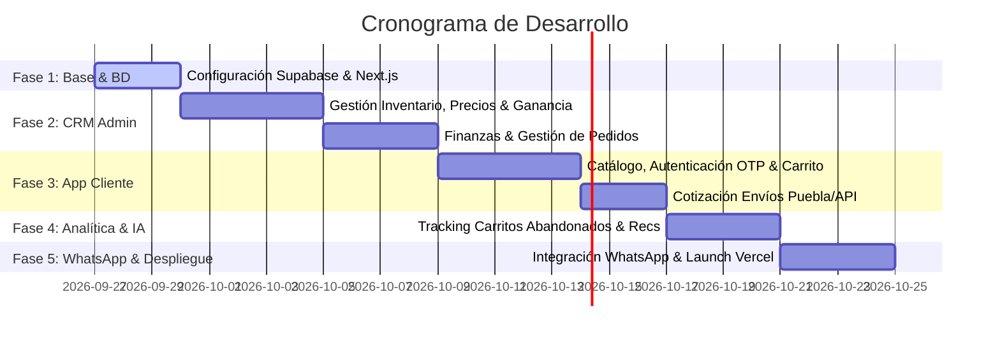

# 🚀 Plan de Arquitectura e Implementación: E-Commerce + CRM de Productos Americanos

Este documento detalla la planificación estratégica, arquitectura técnica recomendada, stack 100% sin costos operativos iniciales (Free Tier) y el desglose de fases de implementación para la plataforma de tienda en línea y panel administrativo.

---

## 1. 🏗️ Arquitectura del Sistema y Stack Tecnológico Propuesto

Para garantizar **costo $0 USD en infraestructura**, alta velocidad, seguridad de datos y soporte óptimo para Web y Móvil (PWA/Responsive), seleccionamos tecnologías modernas con capas gratuitas generosas.

```mermaid
flowchart TD
    subgraph Frontend["💻 Frontend (Next.js 14 / React + Tailwind CSS)"]
        UI_Client["🛍️ App Cliente (Web/Mobile)"]
        UI_CRM["⚙️ CRM Admin (Panel Control)"]
    end

    subgraph Backend Services["⚡ Backend & DB (Supabase - Free Tier)"]
        Auth["🔐 Auth (Email/Pass + OTP)"]
        DB[(🗄️ PostgreSQL Database)]
        RLS["🛡️ Row Level Security & Encriptación"]
        Realtime["📡 Subscripciones Realtime (Carritos & Envíos)"]
    end

    subgraph Analytics & AI["🧠 Analítica e Inteligencia"]
        Analytics["📊 Event Tracking (Carritos abandonados, Visitas)"]
        AI_Recommend["🤖 Recomendador IA (Algoritmo de Frecuencia/Interés)"]
    end

    subgraph External APIs["🌐 Integraciones Externas (Gratuitas)"]
        WA["💬 WhatsApp API / Meta Cloud API (1k msgs gratis/mes)"]
        Shipping["🚚 API Envíos (Skydropx / Envia.com Free Tier / Google Matrix API)"]
    end

    UI_Client --> Auth
    UI_Client --> DB
    UI_Client --> Analytics
    UI_CRM --> DB
    UI_CRM --> AI_Recommend

    DB --> RLS
    Backend Services --> WA
    Backend Services --> Shipping
```

### 🛠️ Selección de Stack (100% Gratuito)
1. **Frontend**: `Next.js 14` (React) + `Tailwind CSS` + `Shadcn UI` (Responsive, ultra rápido, PWA para móviles).
2. **Hosting Frontend**: `Vercel` (Despliegue gratuito con SSL automatizado y dominio personalizado o subdominio `.vercel.app`).
3. **Base de Datos & Backend**: `Supabase` (PostgreSQL administrado con 500MB gratis, autenticación, almacenamiento de imágenes de productos y funciones backend).
4. **Email / OTP Verification**:
   - **Verificación Email + Código**: `Resend` (3,000 correos gratis al mes) o `Supabase Auth`.
   - **Verificación Teléfono / WhatsApp**: OTP enviado por Correo + Validación enlace WhatsApp sin costo.
5. **WhatsApp Integration**:
   - **WhatsApp Business Cloud API (Meta API oficial)**: 1,000 conversaciones gratis al mes iniciadas por clientes.
   - Bot con plantillas para: Confirmación de pedido, carrito abandonado ("Notamos que dejaste algo..."), estatus de envío y atención a pedidos especiales.
6. **Cálculo de Envíos (Puebla y Alrededores)**:
   - **Entregas Locales (Puebla)**: Regla interna por C.P. / Zona con tarifas fijas o calculador de distancia por Coordenadas (OpenStreetMap / Leaflet - Gratis).
   - **Envíos Nacionales / Foráneos**: API de `Envia.com` o `Skydropx` (Cuentas sandbox/gratuitas que entregan cotizaciones reales multipaquetería).

---

## 2. 🧮 CRM & ERP Administrativo (Módulo por Módulo)

### A. Gestión de Inventario y Precios con Costo Promedio de Envío
* **Costeo Inteligente**:
  $$\text{Costo Unitario Total} = \text{Costo Producto (USD/MXN)} + \left( \frac{\text{Costo Envío Lote USA-MX}}{\text{Cantidad Total Unidades del Lote}} \right)$$
* **Cálculo de Margen y Ganancia**:
  $$\text{Ganancia Unitario} = \text{Precio Público} - \text{Costo Unitario Total}$$
  $$\text{Margen \%} = \left( \frac{\text{Ganancia Unitario}}{\text{Precio Público}} \right) \times 100$$
* **Gestión de Stock**: Alertas de inventario bajo y recepción de lotes de importación.

### B. Módulo Financiero
* Dashboard visual con Ingresos Totales, Ganancia Neta Real, Costos de Importación/Envío invertidos y Ticket Promedio.
* Desglose por rango de fecha (diario, semanal, mensual).

### C. Panel de Pedidos y Seguimiento
* Estado de pedidos: *Pendiente, En Preparación, En Ruta (Puebla / Paquetería), Entregado, Cancelado*.
* Generador de mensajes de WhatsApp automatizados en 1 clic para avisar al cliente sobre su paquete.

### D. Módulo de Analítica de Navegación & Carritos Abandonados
* Visualización en tiempo real de productos más vistos, añadidos al carrito sin comprar y carritos abandonados.
* Botón de seguimiento rápido por WhatsApp / Email automatizado con cupón de descuento ("Recupera tu carrito con 5% desc").

---

## 3. 🛍️ Aplicativo Cliente (E-Commerce Web/Mobile)

1. **Catálogo de Productos**: Búsqueda rápida, filtros por categoría (Snacks, Cosméticos, Ropa, Electrónica, etc.), etiquetas de "Producto Bajo Encomienda / Pedido Especial".
2. **Registro & Seguridad de Datos (ARCO / LFPDPPP)**:
   - Registro seguro mediante Email + Contraseña con confirmación OTP.
   - Encriptación de datos sensibles en reposo (PostgreSQL RLS y políticas de cifrado).
   - Aviso de Privacidad visible y aceptación explícita de términos.
3. **Flujo de Compra**:
   - Selección de entrega: *Entrega Acordada en Puebla / Envío Local Puebla / Paquetería Nacional*.
   - Cálculo automático de envío antes de pagar.
4. **Sección del Usuario**: Historial de pedidos, rastreo en vivo de estatus y motor de sugerencias personalizadas basado en compras previas.
5. **Motor de IA Recomendador**:
   - Analiza historial de navegación y compras para mostrar *"También te podría interesar..."*.
   - Genera reportes internos para el administrador sobre tendencias de consumo.

---

## 4. 📅 Plan de Implementación Fase a Fase



### **Fase 1: Configuración de Infraestructura Gratis & Base de Datos**
- Inicialización del proyecto Next.js 14 con Tailwind CSS.
- Creación del proyecto en Supabase (Tablas: `products`, `inventory_batches`, `orders`, `order_items`, `users`, `cart_abandoned`, `analytics_events`).
- Configuración de políticas de seguridad (Row Level Security).

### **Fase 2: Desarrollo del CRM Administrativo**
- Pantalla de alta de productos con desgloses de costo importación, prorrateo de envío y cálculo de margen en tiempo real.
- Panel Financiero (Gráficas de Ingresos vs Ganancia Neta).
- Tablero Kanban / Lista de seguimiento de Pedidos.

### **Fase 3: Desarrollo de la Tienda de Clientes (Web / Móvil)**
- Catálogo responsivo e interactivo.
- Autenticación con verificación por código OTP (Email / WhatsApp link).
- Checkout con selección de envío (Puebla local vs API paquetería).

### **Fase 4: Analítica, Carritos Abandonados e Inteligencia de Negocio**
- Sistema de rastreo de eventos (visitas a productos, agregados a carrito).
- Motor de sugerencias por cliente.
- Panel de recuperación de carritos abandonados.

### **Fase 5: Integración con WhatsApp API & Despliegue**
- Integración de botones de acción rápida y plantillas para avisos por WhatsApp.
- Pruebas de seguridad, optimización de velocidad.
- Publicación final en Vercel.

---

## 🙋‍♂️ Preguntas de Confirmación para Comenzar

Para afinar los detalles antes de escribir la primera línea de código:

1. **Verificación de Usuarios**: ¿Te parece bien usar **verificación por correo electrónico con código de 6 dígitos (OTP)** mediante Resend (100% gratis), complementado con opción de contacto rápido por WhatsApp?
2. **Métodos de Pago**: ¿Los pagos iniciales se realizarán contra entrega / transferencia SPEI directa con validación por WhatsApp, o deseas integrar una pasarela sin costo fijo como Mercado Pago / Stripe?
3. **Mapeo de Zonas en Puebla**: Para entregas en Puebla y alrededores, ¿manejaremos un listado de Códigos Postales / Municipios (Cholula, Angelópolis, Centro, etc.) con tarifas fijas o zonas de entrega gratis?
