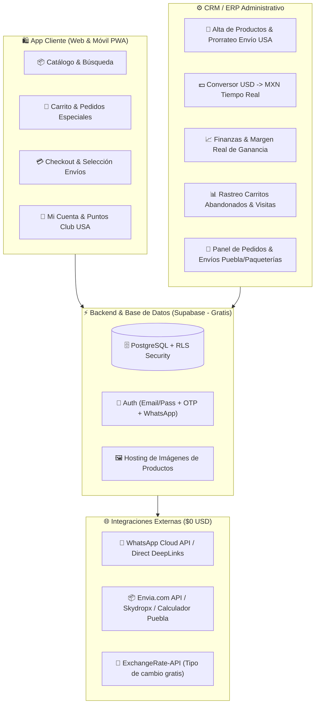
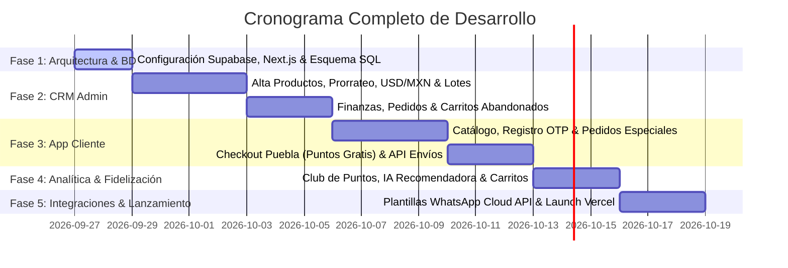

# 🚀 PLAN MAESTRO MEJORADO: E-COMMERCE & CRM/ERP DE PRODUCTOS AMERICANOS
> **Arquitectura:** Next.js 14 + Supabase PostgreSQL + Tailwind CSS + Meta WhatsApp Cloud API  
> **Costo Operativo Fijo:** $0 USD / mes (Infraestructura 100% Free Tier)

---

## 1. 🏗️ Arquitectura General del Sistema

---

## 2. 🧮 CRM / ERP ADMINISTRATIVO (Módulo Ampliado)

### A. Gestión de Productos, Costeos & Conversor Dólares-Pesos
1. **Conversor USD $\rightarrow$ MXN en Tiempo Real**: Consulta automática del tipo de cambio del día.
2. **Calculadora de Costo Real Prorrateado**:
   $$\text{Costo Unitario Total (MXN)} = (\text{Costo Producto USD} \times \text{Tipo Cambio}) + \left( \frac{\text{Costo Envío Lote USA-MX}}{\text{Cantidad Unidades Lote}} \right)$$
3. **Cálculo de Ganancia Neta & Margen**:
   $$\text{Ganancia Neta} = \text{Precio Público} - \text{Costo Unitario Total}$$
   $$\text{Margen \%} = \left( \frac{\text{Ganancia Neta}}{\text{Precio Público}} \right) \times 100$$
4. **Control de Lotes & Alertas de Caducidad**: Alertas para productos cercanos a fecha de vencimiento o con más de 45 días en stock para sugerir liquidaciones.

### B. Módulo Financiero
- Gráficas de ingresos vs. costos reales de importación, margen bruto, ganancia neta diaria/mensual y ticket promedio.

### C. Gestión de Pedidos & Logística en Puebla
- Estados del pedido: *Pendiente $\rightarrow$ En Preparación $\rightarrow$ En Ruta (Puebla) / Guía Asignada $\rightarrow$ Entregado*.
- Enlace automatizado en 1 clic para notificar al cliente vía WhatsApp con plantillas transaccionales.

### D. Panel de Analítica, Carritos Abandonados & Pedidos Especiales
- **Seguimiento de Carritos Abandonados**: Lista de usuarios que dejaron productos en carrito por más de 2h con botón para enviar **Cupón Dinámico de Descuento** por WhatsApp.
- **Gestión de Encargos / Pedidos Especiales**: Solicitudes de productos americanos que no están en inventario.

---

## 3. 🛍️ APLICATIVO CLIENTE (E-Commerce Web/Mobile)

1. **Catálogo Responsivo & Botón WhatsApp Directo**: Cada producto incluye el botón *"Preguntar por este producto en WhatsApp"* con SKU y nombre pre-llenados.
2. **Sección de Pedidos Bajo Demanda / Especiales**: Formulario para solicitar artículos de EE.UU. no presentes en el catálogo.
3. **Registro Seguro & OTP**: Inicio de sesión mediante Correo + Contraseña o Código OTP de 6 dígitos. Cumplimiento con ley de protección de datos personales.
4. **Checkout e Integración Logística (Puebla + Nacional)**:
   - *Opción A*: Punto de Entrega Gratuito en Puebla (Plaza Dorada, Angelópolis, CAPU, Zócalo).
   - *Opción B*: Envío a Domicilio Local Puebla (Costo según zona / C.P.).
   - *Opción C*: Paquetería Nacional (FedEx, Estafeta, DHL vía API).
5. **Club USA (Puntos de Fidelidad) & IA Recomendadora**:
   - Acumulación de puntos por compras.
   - Algoritmo de venta cruzada (*"Quienes compraron este snack también llevaron..."*).

---

## 4. 📅 PLAN DE IMPLEMENTACIÓN Y CRONOGRAMA

---

## 🛠️ Resumen de Fases
- **Fase 1**: Base de Datos PostgreSQL en Supabase, Esquema SQL y Setup Next.js 14.
- **Fase 2**: CRM Administrativo completo (Calculadora USD/MXN, Prorrateo Lotes, Finanzas y Carritos Abandonados).
- **Fase 3**: Tienda Cliente Web/Móvil (Catálogo, Botón WhatsApp Directo, Checkout Puebla + Nacional).
- **Fase 4**: Sistema de Puntos, IA Recomendadora y Rastreo de Analítica.
- **Fase 5**: Integración WhatsApp Cloud API y despliegue final en Vercel ($0 USD).
