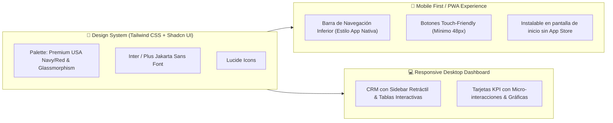

# 🛡️ ESPECIFICACIONES DE SEGURIDAD Y DISEÑO UI/UX (WEB & MOBILE PWA)
> **Complemento al Plan Maestro Consolidado**  
> **Estándar:** Enterprise-Grade Security & Mobile-First Modern Design System

---

## 1. 🛡️ ARQUITECTURA DE SEGURIDAD & PROTECCIÓN DE DATOS (ARCO / LFPDPPP)

### A. Protección de Datos Personales Sensibles
- **Encriptación en Tránsito & Reposo**:
  - **HTTPS / TLS 1.3 Mandatory**: SSL automatizado con HSTS (HTTP Strict Transport Security).
  - **Encriptación PostgreSQL (AES-256)**: Todos los datos almacenados en Supabase están cifrados en reposo.
- **Políticas RLS (Row Level Security)**:
  - Un usuario cliente **solo puede ver sus propios datos de perfil, historial de compras y direcciones**.
  - Los datos financieros, costos de importación y proveedores del CRM son **exclusivos para el rol Admin** (aislados mediante políticas de base de datos a nivel kernel).

### B. Autenticación & Control de Acceso
- **Verificación OTP de 6 dígitos con Expiración**: Los códigos de autenticación expiran en 5 minutos y tienen límite de reintentos (Rate Limiting).
- **Protección contra Ataques**:
  - **Rate Limiting / Anti-Bruteforce**: Máximo 5 intentos de inicio de sesión o solicitud de OTP por IP cada 15 minutos.
  - **Sanitización de Inputs & Anti-XSS**: Escape automático de caracteres especiales en Next.js.
  - **Protección CSRF & Encabezados HTTP Seguros**: Content Security Policy (CSP), X-Frame-Options (DENY), X-Content-Type-Options (nosniff).

### C. Cumplimiento Legal y Privacidad
- **Aviso de Privacidad Integrado (LFPDPPP - México)**: Checkbox obligatorio en el registro para aceptar el tratamiento de datos personales.
- **Módulo de Derechos ARCO**: Opción en el perfil del cliente para *Acceder, Rectificar, Cancelar o Oponerse* al uso de sus datos, así como solicitar la eliminación de su cuenta.

---

## 2. 🎨 SISTEMA DE DISEÑO Y EXPERIENCIA DE USUARIO (UI/UX - WEB & MOBILE PWA)

### A. Paleta de Colores & Identidad Visual
* **Tema Principal**: *American Premium / Modern Clean*.
  * 🔵 **Azul Noche / Royal Blue (`#0F172A` / `#2563EB`)**: Transmite confianza, seguridad y profesionalismo.
  * 🔴 **Rojo Coral Accent (`#EF4444`)**: Para ofertas, botones de acción (*CTA*) y badges de *"Bajo Pedido"*.
  * ⚪ **Fondo Claro (`#F8FAFC`) / Modo Oscuro (`#0F172A`)**: Sombra suave y estilo *Glassmorphism* (efecto traslúcido).
  * 🟢 **Verde WhatsApp (`#22C55E`)**: Botones de contacto y seguimiento en vivo.

### B. Diseño Web & Móvil (Mobile-First / PWA)
- **Experiencia Móvil (PWA - Progressive Web App)**:
  - **Barra de Navegación Inferior (*Bottom Navigation Bar*)**: Acceso rápido a *Inicio, Categorías, Carrito, Pedidos Especiales y Mi Cuenta*.
  - **Gestos Táctiles (*Swipe*)**: Deslizar imágenes de productos y cerrar modales con gestos.
  - **Instalable como App**: El usuario puede presionar *"Agregar a Pantalla de Inicio"* en Android/iOS y usar la tienda como una App nativa sin pasar por Play Store o App Store.
- **Experiencia Web/Desktop (CRM Admin)**:
  - **Sidebar Retráctil**: Navegación fluida entre Inventario, Finanzas, Pedidos y Carritos Abandonados.
  - **Tablas Interactivas**: Ordenamiento rápido, filtros por categoría, búsqueda instantánea y exportación a Excel/PDF.
  - **Micro-interacciones**: Transiciones suaves al agregar productos al carrito o cambiar estados de pedidos.

---

## 🙋‍♂️ Integración al Plan Maestro
Estas especificaciones de **Seguridad Enterprise** y **Diseño UI/UX PWA** quedan integradas como estándares transversales que se aplicarán en cada una de las 5 Fases de Desarrollo.
